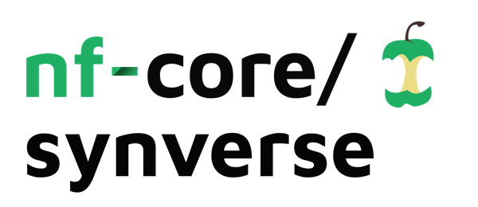
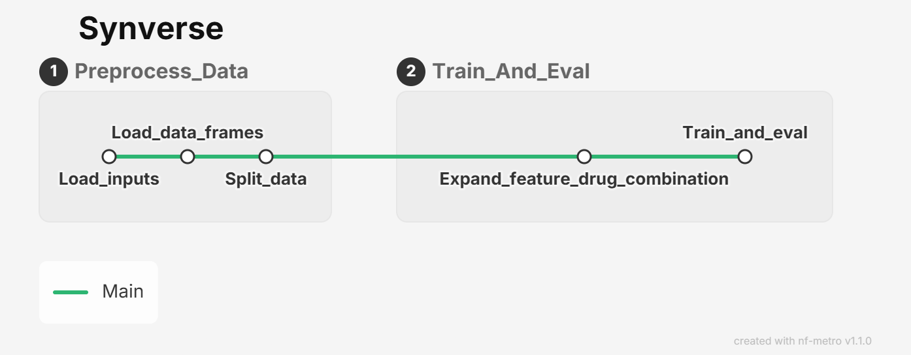

<h1>
  <picture>
    <source media="(prefers-color-scheme: dark)" srcset="docs/images/nf-core-synverse_logo_dark.png">
    
  </picture>
</h1>

[](https://github.com/codespaces/new/nf-core/synverse)
[](https://github.com/Omar-Fahim/synverse/actions/workflows/nf-test.yml)
[](https://github.com/Omar-Fahim/synverse/actions/workflows/linting.yml)
[](https://www.nf-test.com)
[](https://www.nextflow.io/)
[](https://github.com/nf-core/tools/releases/tag/3.5.2)
[](https://docs.conda.io/en/latest/)
[](https://www.docker.com/)
[](https://sylabs.io/docs/)
[](https://cloud.seqera.io/launch?pipeline=https://github.com/nf-core/synverse)

[](https://nfcore.slack.com/channels/synverse)[](https://bsky.app/profile/nf-co.re)[](https://mstdn.science/@nf_core)[](https://www.youtube.com/c/nf-core)

## Introduction

**nf-core/synverse** is a bioinformatics pipeline that is implemented in Nextflow based on the original [Synverse](https://github.com/Murali-group/SynVerse) codebase. **nf-core/synverse** automates key preprocessing and evaluation tasks for drug synergy prediction models, minimizing implementation effort and enabling researchers to focus on developing and improving predictive modeling methods. By contributing your model to the Synverse catalog, you can increase your work's reproducibility, reusability, and transferability.

1. The input data and configuration are loaded.
2. Drug and cell-line features are prepared.
3. Training, validation, and test sets are generated.
4. Features are preprocessed and normalized.
5. Models are trained and evaluated for each feature combination and data split.
6. If shuffle tests are enabled, models are trained and evaluated using shuffled features.
7. If rewire tests are enabled, models are trained and evaluated using rewired networks.
8. If randomized-score tests are enabled, models are trained and evaluated using randomized synergy scores.
9. Results are aggregated and summary plots are generated.
    


## Usage

> [!NOTE]
> If you are new to Nextflow and nf-core, please refer to [this page](https://nf-co.re/docs/usage/installation) on how to set-up Nextflow. Make sure to [test your setup](https://nf-co.re/docs/usage/introduction#how-to-run-a-pipeline) with `-profile test` before running the workflow on actual data.

<!-- TODO nf-core: Describe the minimum required steps to execute the pipeline, e.g. how to prepare samplesheets.
     Explain what rows and columns represent. For instance (please edit as appropriate):

First, prepare a samplesheet with your input data that looks as follows:

`samplesheet.csv`:

```csv
sample,fastq_1,fastq_2
CONTROL_REP1,AEG588A1_S1_L002_R1_001.fastq.gz,AEG588A1_S1_L002_R2_001.fastq.gz
```

Each row represents a fastq file (single-end) or a pair of fastq files (paired end).

-->


This pipeline is intended to run on the FAU NHR HPC clusters. For a complete execution example, including the Slurm job submission script and recommended resource settings, see `scripts/run_synverse.sh`.

**nf-core/synverse** is configured using a YAML configuration file (e.g., assets/testdata/Cluster_Config.yaml), which allows users to specify all training settings, including the input features, model hyperparameters, random seeds, data-splitting strategies, number of runs, and whether to perform cross-validation.

To select the desired experiment, configure the following parameters in the YAML file:

| Experiment | Configuration |
|------------|---------------|
| Regular training | `train_type: regular` |
| Regular training with cross-validation | `train_type: regular`<br>`cv: true` |
| Feature shuffle experiments | `train_type: shuffle` |
| Network rewiring experiments | `train_type: rewire` |
| Randomized synergy score experiments | `train_type: randomized_score` |

When `train_type: rewire` is selected, choose the rewiring method by setting the `rewire_method` parameter in the configuration file:

| Rewiring method | Configuration |
|-----------------|---------------|
| Simulated Annealing | `rewire_method: ["SA"]` |
| Sneppen–Maslov | `rewire_method: ["SM"]` |

## Parsing and Plotting
Create and activate a separate plotting environment before running the parsing and plotting scripts:

```bash
conda create -n synverse_plotting 
conda activate synverse_plotting
pip install -r envs/plotting-requirements.txt
```

After the pipeline finishes, parse the training output files before generating plots. Use the same config file that was used for the pipeline run so the plotting script can find `output_dir`, `score_name`, `abundance`, and the configured split types.

```bash
python -m bin.plots.results_plots \
    --parse \
    --config assets/testdata/Cluster_Config.yaml
```

The parser writes summary files under:

```text
<output_dir>/trainandeval/results/k_<abundance>_<score_name>/
```

Generate plots by selecting one of the supported `--plot_type` values (For comparison plots, complete the preparation steps below before running the commands):

| Plot type | Command | Required parsed files |
| --- | --- | --- |
| Regular model performance | `python -m bin.plots.results_plots --plot --plot_type regular --config assets/testdata/Cluster_Config.yaml` | `output_<split>.tsv` |
| Shuffled feature comparison | `python -m bin.plots.results_plots --plot --plot_type shuffle --config assets/testdata/Cluster_Config.yaml` | `output_<split>.tsv`, `output_<split>_shuffled.tsv` |
| Randomized score comparison | `python -m bin.plots.results_plots --plot --plot_type randomized --config assets/testdata/Cluster_Config.yaml` | `output_<split>.tsv`, `output_<split>_randomized.tsv` |
| Rewired network comparison | `python -m bin.plots.results_plots --plot --plot_type rewired --config assets/testdata/Cluster_Config.yaml` | `output_<split>.tsv`, `output_<split>_rewired.tsv` |
| Cross-validation curves | `python -m bin.plots.results_plots --plot --plot_type cv --config assets/testdata/Cluster_Config.yaml` | `output_<split>.tsv` from a regular run  with `cv.enabled: true` |

Plot PDFs are saved under:

```text
<output_dir>/trainandeval/results/k_<abundance>_<score_name>/plot/vertical/
```

> **Note**
> Comparison plots are generated from the results of two independent pipeline runs (e.g., regular and shuffle). Since the plotting script operates on a single results directory, the parsed output files from both runs must exist in the same results directory before generating the plots.

To generate plots comparing a regular run with a shuffle run \ randomized run:
1. Run the pipeline with `train_type: regular`.
2. Copy the pipeline output directory from the cluster to the project root and rename it to `results`.
3. Run the parsing script.
4. Rename the parsed output directory (e.g., `results_regular`) to preserve it.
5. Run the pipeline with `train_type: shuffle \ randomized_score`.
6. Copy the pipeline output directory from the cluster to the project root and rename it to `results`.
7. Run the parsing script.
8. Copy the following files from the regular run into the corresponding location of the shuffle run:
   - `output_leave_cell_line.tsv`
   - `output_leave_comb.tsv`
   - `output_random.tsv`
   - `output_leave_drug.tsv`
9. Run the plotting script to generate the comparison plots.


To generate plots comparing a regular run with rewired runs:

1. Run the pipeline with `train_type: regular`.
2. Copy the pipeline output directory from the cluster to the project root and rename it to `results`.
3. Run the parsing script.
4. Rename the parsed output directory (e.g., `results_regular`) to preserve it.
5. Run the pipeline with `train_type: rewire` and `rewire_method: ["SA"]`.
6. Copy the pipeline output directory from the cluster to the project root and rename it to `results`.
7. Run the parsing script.
8. Rename the parsed output directory (e.g., `results_rewired_SA`) to preserve it.
9. Run the pipeline with `train_type: rewire` and `rewire_method: ["SM"]`.
10. Copy the pipeline output directory from the cluster to the project root and rename it to `results`.
11. Run the parsing script.
12. Combine the results from the two rewiring methods:

 ```bash
python combine_rewired_tsvs.py \
    --sa_dir <path/to/SA_rewired_output_directory> \
    --sm_dir <path/to/SM_rewired_output_directory> \
    --out_dir <path/to/output_directory> (could be the same as sm_dir, if you want to skip the copying and pasting of the generated files)
```
where `--sa_dir` and `--sm_dir` should point to the directory containing:

- `output_leave_cell_line_rewired.tsv`
- `output_leave_comb_rewired.tsv`
- `output_leave_drug_rewired.tsv`
- `output_random_rewired.tsv`

13. Copy the generated files into the corresponding location of the `results` directory, replacing the existing files.
14. Copy the following files from the regular run into the corresponding location of the `results` directory:
    - `output_leave_cell_line.tsv`
    - `output_leave_comb.tsv`
    - `output_random.tsv`
    - `output_leave_drug.tsv`
15. Run the plotting script to generate the comparison plots.


> [!WARNING]
> Please provide pipeline parameters via the CLI or Nextflow `-params-file` option. Custom config files including those provided by the `-c` Nextflow option can be used to provide any configuration _**except for parameters**_; see [docs](https://nf-co.re/docs/usage/getting_started/configuration#custom-configuration-files).

For more details and further functionality, please refer to the [usage documentation](https://nf-co.re/synverse/usage) and the [parameter documentation](https://nf-co.re/synverse/parameters).

## Pipeline output

To see the results of an example test run with a full size dataset refer to the [results](https://nf-co.re/synverse/results) tab on the nf-core website pipeline page.
For more details about the output files and reports, please refer to the
[output documentation](https://nf-co.re/synverse/output).

## Credits

nf-core/synverse was originally written by Omar Shaaban, Judith Bernett.

We thank the following people for their extensive assistance in the development of this pipeline:

<!-- TODO nf-core: If applicable, make list of people who have also contributed -->

## Contributions and Support

If you would like to contribute to this pipeline, please see the [contributing guidelines](.github/CONTRIBUTING.md).

For further information or help, don't hesitate to get in touch on the [Slack `#synverse` channel](https://nfcore.slack.com/channels/synverse) (you can join with [this invite](https://nf-co.re/join/slack)).

## Citations

<!-- TODO nf-core: Add citation for pipeline after first release. Uncomment lines below and update Zenodo doi and badge at the top of this file. -->
<!-- If you use nf-core/synverse for your analysis, please cite it using the following doi: [10.5281/zenodo.XXXXXX](https://doi.org/10.5281/zenodo.XXXXXX) -->

<!-- TODO nf-core: Add bibliography of tools and data used in your pipeline -->

An extensive list of references for the tools used by the pipeline can be found in the [`CITATIONS.md`](CITATIONS.md) file.

You can cite the `nf-core` publication as follows:

> **The nf-core framework for community-curated bioinformatics pipelines.**
>
> Philip Ewels, Alexander Peltzer, Sven Fillinger, Harshil Patel, Johannes Alneberg, Andreas Wilm, Maxime Ulysse Garcia, Paolo Di Tommaso & Sven Nahnsen.
>
> _Nat Biotechnol._ 2020 Feb 13. doi: [10.1038/s41587-020-0439-x](https://dx.doi.org/10.1038/s41587-020-0439-x).
